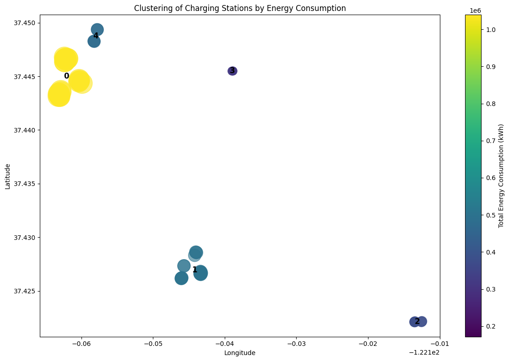
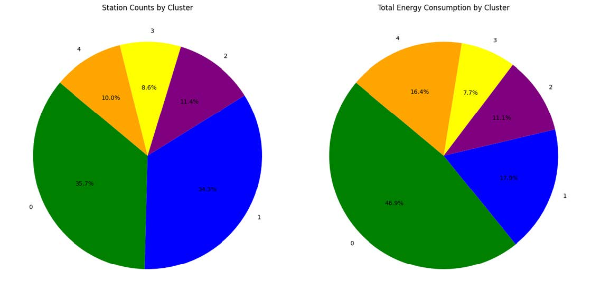

# Optimization-of-Electric-Vehicle-Charging-Station-Placement-and-Scheduling-using-Palo-Alto-CA-data
This project aims to optimize the placement of EV charging stations as well as charging scheduling in Palo Alto, CA.

# 🔌 EV Charging Station Optimization: Placement & Scheduling

## 📌 Project Overview
With the rapid growth of **electric vehicles (EVs)**, the demand for **efficient charging infrastructure** has surged. This project focuses on **optimizing the placement of charging stations** and **scheduling charging sessions** to enhance accessibility and efficiency for EV users. The project applies **geographical analysis, clustering algorithms, and scheduling using priority queue** to address these challenges.

---

## 📂 Table of Contents
- [Introduction](#introduction)
- [Data Exploration](#data-exploration)
- [Problem Formulation](#problem-formulation)
- [Methodology](#methodology)
- [Geographical Analysis](#geographical-analysis)
- [Scheduling System](#scheduling-system)
- [Results & Discussion](#results--discussion)
- [Conclusion & Future Work](#conclusion--future-work)
- [References](#references)

---

## 📖 Introduction
### 🎯 **Objective**
- **Optimize charging station placement** based on demand patterns.
- **Develop an efficient scheduling system** to manage charging sessions.
- **Improve accessibility and reduce wait times** at EV charging stations.

### 📊 **Dataset**
- **Source:** [EV Charging Station Usage (California City)](https://www.kaggle.com/datasets/venkatsairo4899/ev-charging-station-usage-of-california-city)
- **Additional Reference:** [Estimating EV Electricity Use (NBER)](https://www.nber.org/papers/w28451)

---

## 🔍 Data Exploration
The dataset includes detailed information about charging sessions:

- **Station Information**: Charging station names, organizations, MAC addresses.
- **Session Timing**: Start/end times, durations, time zones.
- **Energy Data**: Energy consumption, greenhouse gas savings, gasoline savings.
- **Geographical Data**: Locations (addresses, cities, states, latitude, longitude).
- **User Information**: User IDs, postal codes, session fees.

---

## 📌 Problem Formulation
### 🚗 **Station Placement Optimization**
- Analyze **usage patterns** and **demand clustering** to optimize station distribution.
- Identify **underserved areas** needing additional stations.

### ⏳ **Charging Session Scheduling**
- Develop a **priority-based scheduling system**.
- Reduce **waiting times** and **optimize station utilization**.

---

## 🛠 Methodology
### 🏙 **Geographical Clustering**
- **K-Means Clustering** was applied to group stations into **5 clusters** (optimal count determined via **elbow method**).
- The **clusters** provide insights into **station density and demand variations**.

### 📊 **Visualizations**
- **Heatmap** of station usage and power consumption.
- **Pie chart** summarizing station demand across clusters.

### 🕒 **Scheduling Algorithm**
- **Priority Queue** used to manage **charging sessions**:
  - Assigns sessions **based on start time and availability**.
  - Balances **station utilization** and **minimizes waiting periods**.

---

## 🌍 Geographical Analysis


## Lighter the color indicates higher engergy consumption, Darker the color indicates lower energy consumption.
### 📌 **Cluster Summary**
| Cluster | # Stations | Avg Energy Consumption | Insights |
|---------|------------|------------------------|----------|
| **0** | High | High | High demand, Balanced distribution |
| **1** | Moderate | Moderate | Needs more stations |
| **2** | Moderate | Low | Balanced distribution |
| **3** | Low | Low | Balanced distribution  |
| **4** | Low | Moderate | needs more stations |


📍 **Key Findings:**
- **Cluster 0**: **High demand**, but fewer stations → Suggests expansion.
- **Cluster 1**: **More stations but low usage** → May need redistribution.
- **Clusters 2 & 3**: **Balanced distribution**
- **Cluster 4**: **Underserved areas** → May need redistribution.

---

## ⚡ Scheduling System
### 🔹 **Priority Queue-Based Scheduling**
- **Session Assignment**: Assigns charging sessions based on **availability**.
- **Queue Processing**: Sequentially schedules sessions to **minimize wait times**.
- **Load Balancing**: Ensures **balanced usage** across all stations.

### 🔍 **Performance Insights**
✅ **Reduced wait times** for high-demand stations.  
✅ **Balanced station utilization**, reducing station idleness.  
✅ **Effectively managed session overflow**, preventing station congestion.  

---

## 📊 Results & Discussion
### 📌 **Station Distribution**
- **Geographical clustering** and **station summaries** identified opportunities for **redistribution**:
  - **Reallocating stations from Cluster 0 to Clusters 1 & 4** can **balance demand**.
  - Future growth planning should consider **regional EV ownership trends**.

### 🕒 **Scheduling Performance**
- **Efficient queue processing**, reducing **idle time** and **wait periods**.
- **Overflow sessions were successfully managed**, with minimal session drops.

---

## 🏁 Conclusion & Future Work
### ✅ **Key Takeaways**
- **Geographical clustering** revealed **imbalances in station distribution**.
- **Priority queue scheduling system** effectively optimized **session management**.
- **Potential underserved areas** were identified for **future expansion**.

### 🚀 **Future Improvements**
1. **Demand Forecasting**: Incorporate **regional EV adoption trends**.
2. **Advanced Scheduling**: Implement **AI-driven dynamic scheduling**.
3. **User Feedback**: Gather real-world **EV user insights** to improve station accessibility.

---

## 📚 References
- **Dheekonda, V. R.** (2023). *EV Charging Station Usage of California City*. [Kaggle](https://www.kaggle.com/datasets/venkatsairo4899/ev-charging-station-usage-of-california-city).
- **Burlig, F., Bushnell, J. B., Rapson, D. S., & Wolfram, C.** (2021). *Low Energy: Estimating Electric Vehicle Electricity Use*. [NBER](https://www.nber.org/papers/w28451).

---

## 🚀 How to Use This Project
### 🛠 Installation
```bash
git clone https://github.com/ericylc23/EV-Charging-Optimization.git
cd EV-Charging-Optimization
pip install -r requirements.txt
```
## 📬 Contact
For questions or collaborations, please reach out to me via:

📧 Email: ericylc@bu.edu
🔗 LinkedIn: https://www.linkedin.com/in/eric-yuanlc/
